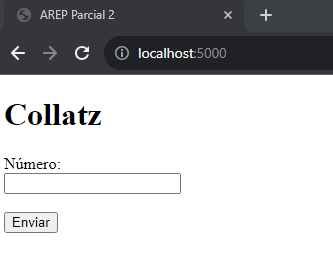
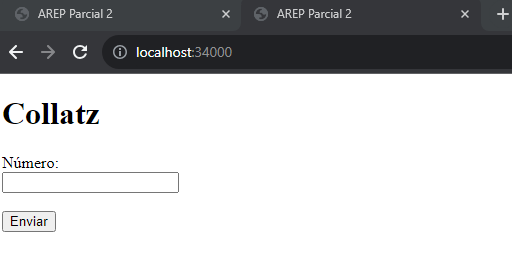
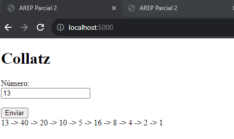
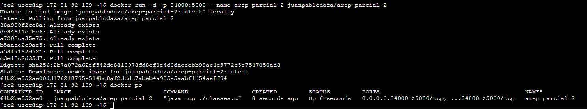
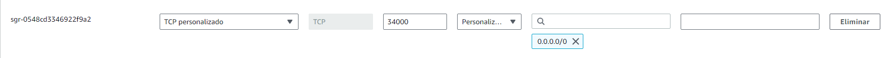
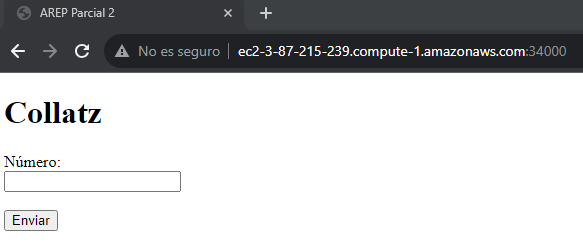
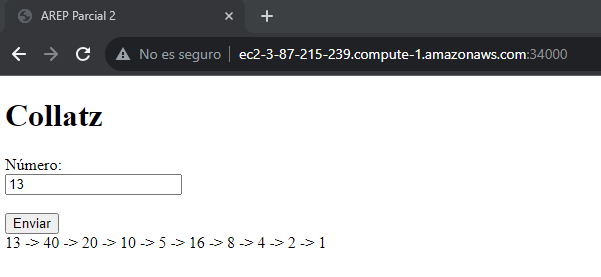

# AREP-Parcial-2

## Autor: Juan Pablo Daza Pinzón

### Clonar y ejecutar:

Para poder clonar el proyecto es necesario tener Git instalado, luego se puede usar el comando:

```
git clone https://github.com/JuanPabloDaza/AREP-Parcial-2
```

Para ejecutarlo es necesario tener Maven instalado, una vez instalado utilizamos el siguiente comando en el directorio raiz:

```
mvn exec:java
```

Tambien esta la posibilidad de crear un contenedor con Docker, la imagen esta en su respectivo repositorio: https://hub.docker.com/repository/docker/juanpablodaza/arep-parcial-2/general

Si se tiene Docker instalado es posible utilizar el siguiente comando para crear un contenedor y comprobar el funcionamiento.

```
docker run -d -p 34000:5000 --name arep-parcial-2 juanpablodaza/arep-parcial-2
```

### Arquitectura:

La arquitectura se compone de una sola clase Collatz.java la cual usa Spark. Esta clase responde a las peticiones REST y retorna el resultado de la función requerida. La función en este caso es la secuencia Collatz, si se conecta al servidor, este retorna el index.html y dentro de este hay un espacio para escribir el número y enviarlo para recibir el resultado:<br>

Utilizando el comando ```mvn exec:java```:<br>

<br>

Utilizando el contenedor de docker:<br>

<br>

### Funcionamiento:

Como mostré anteriormente solo necesitamos escribir el numero en el campo y presionar el botón enviar:<br>

<br>

Podemos ver que el servicio funciona y se muestra el resultado.

### Despliegue en AWS:

Para esto vamos a manejar una instancia EC2, dentro de esta debemos instalar Docker y realizar lo siguiente: <br>

<br>

De lo anterior podemos ver que usamos el mismo comando de Docker que escribí anteriormente en este documento. No debemos olvidarnos de que debemos abrir el puerto 34000 para poder realizar la prueba:

<br>

Ahora usando la direccion ipv4 (http://ec2-3-87-215-239.compute-1.amazonaws.com/) que nos facilita AWS de la instancia podemos realizar la misma prueba escribiendo el puerto 34000 que es el que asignamos al contenedor de Docker:<br>

<br>

Ahora realizamos la prueba de la función:<br>

<br>

La grabación del funcionamiento es la siguiente: https://pruebacorreoescuelaingeduco.sharepoint.com/:v:/s/Reunion468/EaIXvQyDFR9KoHpJ73dRPYMBZPEA2NWMjxfbxKRek-fRGw?e=4vpanb&nav=eyJyZWZlcnJhbEluZm8iOnsicmVmZXJyYWxBcHAiOiJTdHJlYW1XZWJBcHAiLCJyZWZlcnJhbFZpZXciOiJTaGFyZURpYWxvZyIsInJlZmVycmFsQXBwUGxhdGZvcm0iOiJXZWIiLCJyZWZlcnJhbE1vZGUiOiJ2aWV3In19

