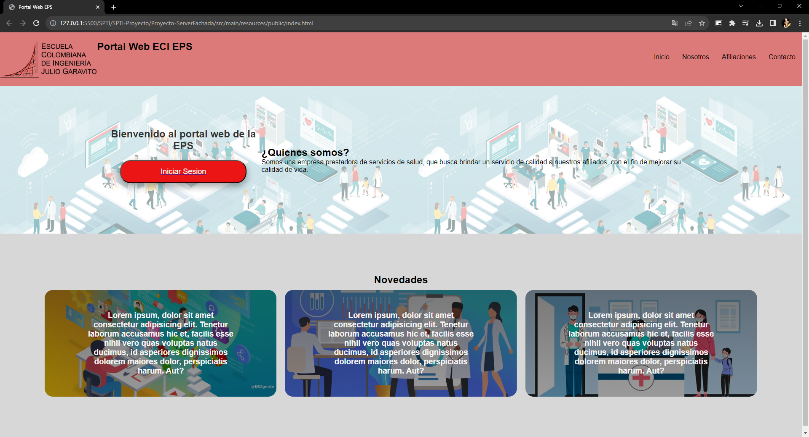

# SPTI-AREP-Proyecto-SOAR
## Integrantes: Juan Pablo Daza Pinzón - Juan Sebastian Rodriguez Peña
## Información:
En este repositorio se encuentra el codigo de el Web server y el portal Usuario del proyecto basado en la implementación del SOAR en una arquitectura que mejore la seguridad.<br>
La investigación se realizo en dos documentos, uno para el curso de AREP y otro para SPTI, los dos estan en el repositorio junto con sus diapositivas y el video de la implementación.
### Comandos Docker:
```
docker run -d -p 34000:5000 --name servidor-fachada juanpablodaza/spti-servidorfachada
```

```
docker run -d -p 42000:42000 --name servidor-portalusuario juanpablodaza/spti-servidorportalusuario
```

<br>

<br>

<br>

<br>

<br>
