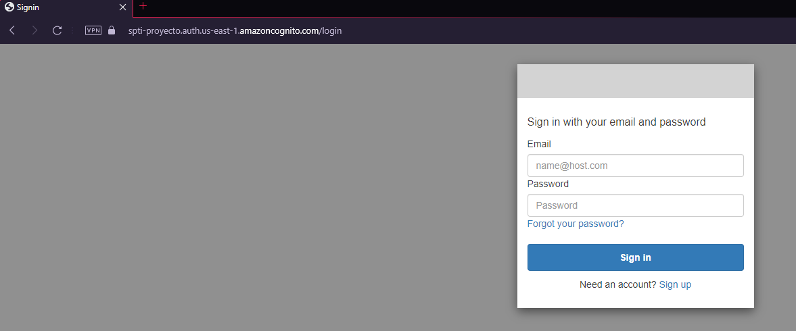

# SPTI-Proyecto-SOAR
### Comandos Docker:
```
docker run -d -p 34000:5000 --name servidor-fachada juanpablodaza/spti-servidorfachada
```

```
docker run -d -p 42000:42000 --name servidor-portalusuario juanpablodaza/spti-servidorportalusuario
```

<br>

<br>

<br>

<br>